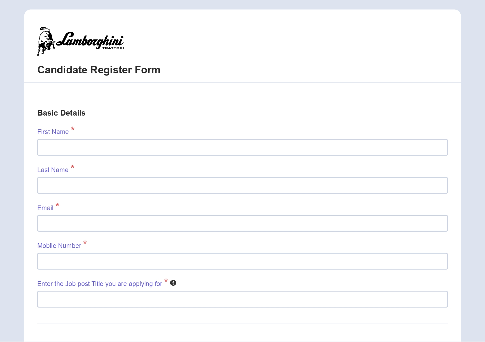
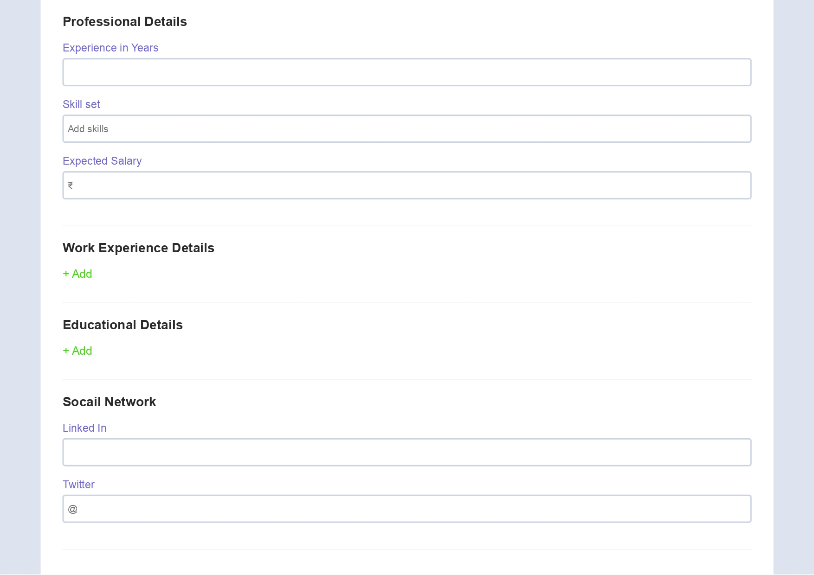
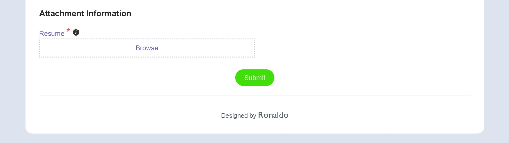
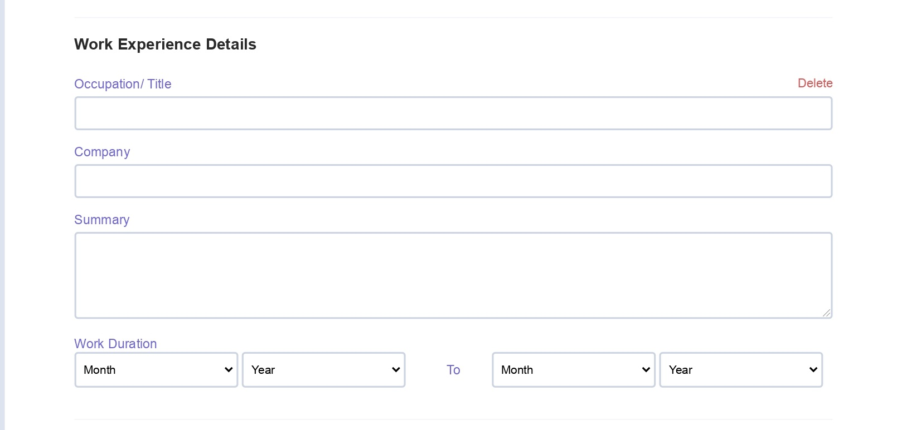
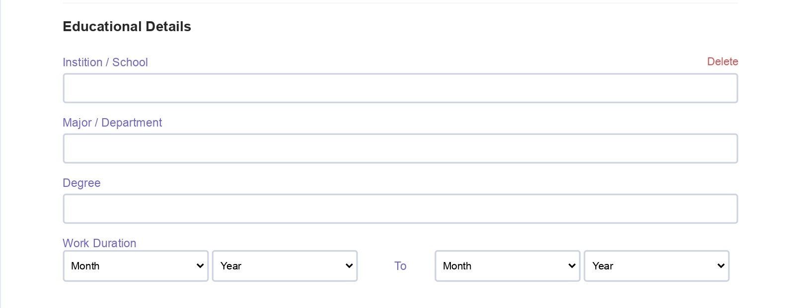

# Candidate-Registration-Form
This one is the candidate Registration form.To fill the details of the candidate with the Full name,email,phone number,professional details,educational details,work experience details,social media details.

# Full form preview

*****
# To add/del form-table

1)Work experience details

- For work experience details normal in the candidate form

- To click add button to generate the full experience details form.
- If you want to delete the experience detail form.You click the delete button to delete form-table.

2)Educational details

- For educational details normal in the candidate form

- To click add button to generate the full experience details form.
- If you want to delete the educational detail form.You click the delete button to delete the form-table.

